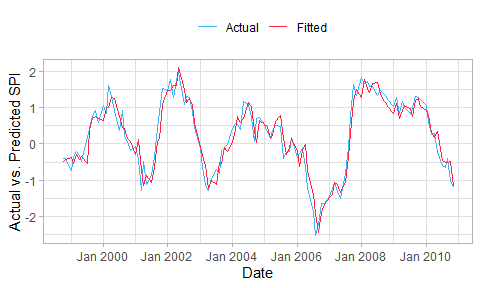

droughtR
================


droughtR is an R for package that enables drought monitoring and drought
forecasting. It computes the Standardized Precipitation Index (SPI) and
the Non-Standardized Precipitation Index (NSPI) using General Additive
Models for Location Scale and Shape (GAMLSS). It enables the generation
of drought forecasts for univariate time series and deals with the bias
introduced to drought forecasting applications when SPI and NSPI are
calculated incorrectly during out-of-sample (OOS) validation.

## Installation

``` r
# Install the development version on Github
devtools::install_github("mammask/droughtr")
```

## Usage

### Generate SPI and NSPI

``` r
# Load droughtr library
library(droughtr)
#> Loading required package: forecast
#> Registered S3 method overwritten by 'quantmod':
#>   method            from
#>   as.zoo.data.frame zoo
#> Loading required package: gamlss
#> Loading required package: splines
#> Loading required package: gamlss.data
#> 
#> Attaching package: 'gamlss.data'
#> The following object is masked from 'package:datasets':
#> 
#>     sleep
#> Loading required package: gamlss.dist
#> Loading required package: MASS
#> Loading required package: nlme
#> 
#> Attaching package: 'nlme'
#> The following object is masked from 'package:forecast':
#> 
#>     getResponse
#> Loading required package: parallel
#>  **********   GAMLSS Version 5.3-4  **********
#> For more on GAMLSS look at https://www.gamlss.com/
#> Type gamlssNews() to see new features/changes/bug fixes.
#> 
#> Attaching package: 'gamlss'
#> The following object is masked from 'package:forecast':
#> 
#>     CV
#> Warning: replacing previous import 'gamlss::CV' by 'forecast::CV' when loading
#> 'droughtr'

# Generate synthetic monthly rainfall data using the Gamma distribution
rain = dummyrainfall(startYear = 1950, endYear = 2010)

# Compute the non-stationary standardized precipitation index (NSPI) for scale 12 using GAMLSS
drought = computenspi(monthlyRainfall = rain, stationaryspi = FALSE, spiScale = 12)
#> GAMLSS-RS iteration 1: Global Deviance = 3370.364 
#> GAMLSS-RS iteration 2: Global Deviance = 3370.324 
#> GAMLSS-RS iteration 3: Global Deviance = 3370.324

# Plot NSPI
plot(drought)
```

<!-- -->

### Reduced-Bias forecasting framework

#### Data Split

Split the rainfall series into training validation and test set.

``` r
rain = oossplit(x = rain, trainratio = 0.6, validationratio = 0.2, testratio = 0.2)
print(rain)
#>          Date Rainfall AccumPrecip Trend       mu      sigma     ecdfm
#>   1: Jan 1950 9.231276          NA    NA       NA         NA        NA
#>   2: Feb 1950 6.474338          NA    NA       NA         NA        NA
#>   3: Mar 1950 9.677603          NA    NA       NA         NA        NA
#>   4: Apr 1950 8.489991          NA    NA       NA         NA        NA
#>   5: May 1950 7.359738          NA    NA       NA         NA        NA
#>  ---                                                                  
#> 606: Jul 2010 9.096594    98.50469   595 94.99487 0.04533240 0.7939698
#> 607: Aug 2010 8.386214    99.22035   596 94.99197 0.04534379 0.8370829
#> 608: Sep 2010 9.976719    98.36749   597 94.98907 0.04535520 0.7852775
#> 609: Oct 2010 9.447542   100.15536   598 94.98617 0.04536660 0.8836696
#> 610: Nov 2010 7.398056   100.28370   599 94.98327 0.04537801 0.8892699
#>           NSPI Split
#>   1:        NA  <NA>
#>   2:        NA  <NA>
#>   3:        NA  <NA>
#>   4:        NA  <NA>
#>   5:        NA  <NA>
#>  ---                
#> 606: 0.8202731  Test
#> 607: 0.9825395  Test
#> 608: 0.7901416  Test
#> 609: 1.1935325  Test
#> 610: 1.2226547  Test
```

#### Bias measurement

When the Standardized Precipitation Index is calculated as part of a
forecasting task it can potentially introduce biases in the training
data. This is mainly because in many cases the index is computed using
the entire data, prior to model validation, and this violates some of
the fundamental principles of time series forecasting theory.

In this section, we compute the amount of bias introduced to the
training set by measuring the number of miss-classifications in the
training data. Two computational approaches are presented: 1) SPI is
computed using the training data only; we call this as “Bias Corrected”
computation and 2) SPI is computed using the entire data; we call this
as “Bias Induced” computation.

We measure bias by computing the number of miss-classifications in the
training set due to the incorrect computation of the index. We also
measure the number of records impacted and share a plot of the two
computational approaches.

``` r
# Generate synthetic monthly rainfall data using the Gamma distribution
rain = dummyrainfall(startYear = 1950, endYear = 2010)

# Compute bias
bias = measurebias(x = rain, trainratio = 0.6, validationratio = 0.2, testratio = 0.2, stationaryspi = TRUE, spiscale = 12)
bias
#> $Transitions
#>     Bias Corrected Class Bias Induced Class   N
#>  1:             Very Wet           Very Wet   8
#>  2:          Near Normal        Near Normal 219
#>  3:       Moderately Wet     Moderately Wet  20
#>  4:        Extremely Wet           Very Wet   9
#>  5:             Very Wet     Moderately Wet  12
#>  6:       Moderately Wet        Near Normal  20
#>  7:       Moderately Dry     Moderately Dry  29
#>  8:          Near Normal     Moderately Dry   8
#>  9:       Moderately Dry           Very Dry   7
#> 10:             Very Dry           Very Dry  13
#> 11:             Very Dry      Extremely Dry   2
#> 12:        Extremely Dry      Extremely Dry   6
#> 13:        Extremely Wet      Extremely Wet   2
#> 
#> $`Impacted Records`
#> [1] "16.34% of records changed drought class"
#> 
#> $Plot
```

<!-- -->

#### Bias Corrected auto.arima

In this section, we perform out-of-sample validation using a bias
corrected auto.arima to forecast the Standardized Precipitation Index
(SPI). An additional parameter is introduced to forecast::auto.arima and
requires fitting a S-ARIMA model.

``` r
# out-of-sample validation using a bias corrected auto.arima
model = bcoosautoarima(x = rain,
                       trainratio = 0.8,
                       validationratio = 0.0,
                       testratio = 0.2,
                       stationaryspi = TRUE,
                       spiscale = 12,
                       seasonal = TRUE)
#>   |                                                                                                            |                                                                                                    |   0%  |                                                                                                            |=                                                                                                   |   1%  |                                                                                                            |==                                                                                                  |   2%  |                                                                                                            |===                                                                                                 |   3%  |                                                                                                            |====                                                                                                |   4%  |                                                                                                            |=====                                                                                               |   5%  |                                                                                                            |======                                                                                              |   6%  |                                                                                                            |=======                                                                                             |   7%  |                                                                                                            |========                                                                                            |   8%  |                                                                                                            |=========                                                                                           |   9%  |                                                                                                            |==========                                                                                          |  10%  |                                                                                                            |===========                                                                                         |  11%  |                                                                                                            |============                                                                                        |  12%  |                                                                                                            |=============                                                                                       |  13%  |                                                                                                            |==============                                                                                      |  14%  |                                                                                                            |===============                                                                                     |  15%  |                                                                                                            |================                                                                                    |  16%  |                                                                                                            |=================                                                                                   |  17%  |                                                                                                            |==================                                                                                  |  18%  |                                                                                                            |===================                                                                                 |  19%  |                                                                                                            |====================                                                                                |  20%  |                                                                                                            |=====================                                                                               |  21%  |                                                                                                            |======================                                                                              |  22%  |                                                                                                            |=======================                                                                             |  23%  |                                                                                                            |========================                                                                            |  24%  |                                                                                                            |=========================                                                                           |  25%  |                                                                                                            |==========================                                                                          |  26%  |                                                                                                            |===========================                                                                         |  27%  |                                                                                                            |============================                                                                        |  28%  |                                                                                                            |=============================                                                                       |  29%  |                                                                                                            |==============================                                                                      |  30%  |                                                                                                            |===============================                                                                     |  31%  |                                                                                                            |================================                                                                    |  32%  |                                                                                                            |=================================                                                                   |  33%  |                                                                                                            |==================================                                                                  |  34%  |                                                                                                            |===================================                                                                 |  35%  |                                                                                                            |====================================                                                                |  36%  |                                                                                                            |=====================================                                                               |  37%  |                                                                                                            |======================================                                                              |  38%  |                                                                                                            |=======================================                                                             |  39%  |                                                                                                            |========================================                                                            |  40%  |                                                                                                            |=========================================                                                           |  41%  |                                                                                                            |==========================================                                                          |  42%  |                                                                                                            |===========================================                                                         |  43%  |                                                                                                            |============================================                                                        |  44%  |                                                                                                            |=============================================                                                       |  45%  |                                                                                                            |==============================================                                                      |  46%  |                                                                                                            |===============================================                                                     |  47%  |                                                                                                            |================================================                                                    |  48%  |                                                                                                            |=================================================                                                   |  49%  |                                                                                                            |==================================================                                                  |  50%  |                                                                                                            |===================================================                                                 |  51%  |                                                                                                            |====================================================                                                |  52%  |                                                                                                            |=====================================================                                               |  53%  |                                                                                                            |======================================================                                              |  54%  |                                                                                                            |=======================================================                                             |  55%  |                                                                                                            |========================================================                                            |  56%  |                                                                                                            |=========================================================                                           |  57%  |                                                                                                            |==========================================================                                          |  58%  |                                                                                                            |===========================================================                                         |  59%  |                                                                                                            |============================================================                                        |  60%  |                                                                                                            |=============================================================                                       |  61%  |                                                                                                            |==============================================================                                      |  62%  |                                                                                                            |===============================================================                                     |  63%  |                                                                                                            |================================================================                                    |  64%  |                                                                                                            |=================================================================                                   |  65%  |                                                                                                            |==================================================================                                  |  66%  |                                                                                                            |===================================================================                                 |  67%  |                                                                                                            |====================================================================                                |  68%  |                                                                                                            |=====================================================================                               |  69%  |                                                                                                            |======================================================================                              |  70%  |                                                                                                            |=======================================================================                             |  71%  |                                                                                                            |========================================================================                            |  72%  |                                                                                                            |=========================================================================                           |  73%  |                                                                                                            |==========================================================================                          |  74%  |                                                                                                            |===========================================================================                         |  75%  |                                                                                                            |============================================================================                        |  76%  |                                                                                                            |=============================================================================                       |  77%  |                                                                                                            |==============================================================================                      |  78%  |                                                                                                            |===============================================================================                     |  79%  |                                                                                                            |================================================================================                    |  80%  |                                                                                                            |=================================================================================                   |  81%  |                                                                                                            |==================================================================================                  |  82%  |                                                                                                            |===================================================================================                 |  83%  |                                                                                                            |====================================================================================                |  84%  |                                                                                                            |=====================================================================================               |  85%  |                                                                                                            |======================================================================================              |  86%  |                                                                                                            |=======================================================================================             |  87%  |                                                                                                            |========================================================================================            |  88%  |                                                                                                            |=========================================================================================           |  89%  |                                                                                                            |==========================================================================================          |  90%  |                                                                                                            |===========================================================================================         |  91%  |                                                                                                            |============================================================================================        |  92%  |                                                                                                            |=============================================================================================       |  93%  |                                                                                                            |==============================================================================================      |  94%  |                                                                                                            |===============================================================================================     |  95%  |                                                                                                            |================================================================================================    |  96%  |                                                                                                            |=================================================================================================   |  97%  |                                                                                                            |==================================================================================================  |  98%  |                                                                                                            |=================================================================================================== |  99%  |                                                                                                            |====================================================================================================| 100%
```

The model returns a set of diagnostics and analytical outcomes,
including the model description, diagnostics plots and actual
vs. predicted forecasts.

``` r
# Return the model description
model[['Diagnostics']][['Model Description']]
#> [1] "ARIMA(1,0,0)(2,0,0)[12] with zero mean"

# Return R2 score in the test set
model[['Diagnostics']][['R2 Score Test']]
#> [1] 0.8737064
```

Actual vs. predicted SPI in the test set

``` r
model[['Diagnostics']][['Actual vs Predicted Test']]
```

<!-- -->

Additional models are developed and can be found here:

-   Bias induced auto.arima
-   Bias corrected modwt auto.arima
-   Bias corrected Support Vector Regression
-   Bias corrected modwt Support Vector Regression
