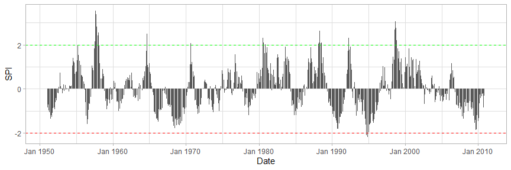
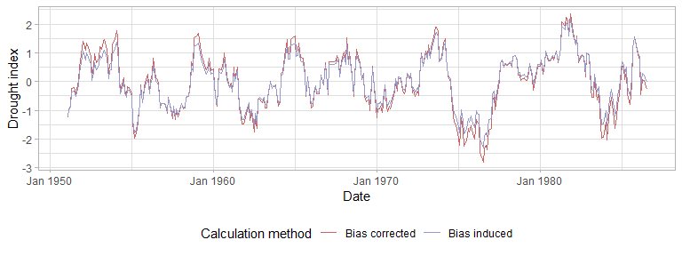
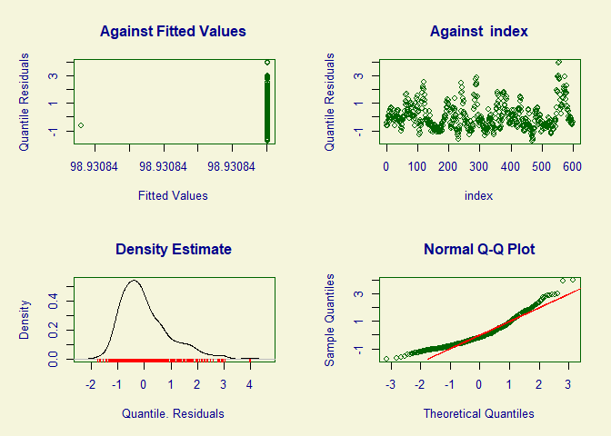

droughtR
================

[](https://zenodo.org/doi/10.5281/zenodo.10009276)


The goal of `droughtR` is to enable meteorological drought monitoring by
generating non-stationary drought indices under various distributional
assumptions (Normal, Gamma, Zero Inflated Gamma and Weibull). It
computes the stationary (SPI) and the non-stationary (NSPI) Standardized
Precipitation Indices using General Additive Models for Location Scale
and Shape (GAMLSS).

<!-- Since drought indices are mainly used in forecasting applications, `droughtR` computes potential biases introduced during the model building process due to incorrect computation of the index. -->

## Installation

``` r
# Install the development version on Github
devtools::install_github("mammask/droughtR")
```

## Usage

### Generate SPI and NSPI

The function `computenspi` creates stationary and non-stationary
meteorological drought indices at different time scales. By default,
droughtR uses the gamma distribution:

``` r
# Load droughtR library
library(droughtR)
#> Registered S3 method overwritten by 'quantmod':
#>   method            from
#>   as.zoo.data.frame zoo

# Generate synthetic monthly rainfall data using the Gamma distribution
rain = dummyrainfall(startYear = 1950, endYear = 2010)

# Compute the non-stationary standardized precipitation index (NSPI) for scale 12 using GAMLSS
nonstatdrought = computenspi(x = rain, stationaryspi = FALSE, spiScale = 12, dist = 'gamma')
#> GAMLSS-RS iteration 1: Global Deviance = 3337.271 
#> GAMLSS-RS iteration 2: Global Deviance = 3337.209 
#> GAMLSS-RS iteration 3: Global Deviance = 3337.209

# Plot NSPI
plot(nonstatdrought)
```


``` r
# Compute the stationary standardized precipitation index (NSPI) for scale 12 using GAMLSS and the weibull distribution
statdrought = computenspi(x = rain, stationaryspi = TRUE, spiScale = 12, dist = 'weibull')
#> GAMLSS-RS iteration 1: Global Deviance = 3527.247 
#> GAMLSS-RS iteration 2: Global Deviance = 3497.37 
#> GAMLSS-RS iteration 3: Global Deviance = 3497.226 
#> GAMLSS-RS iteration 4: Global Deviance = 3497.225 
#> GAMLSS-RS iteration 5: Global Deviance = 3497.225

# Plot SPI 
plot(statdrought)
```



### Compute the Drought Events

`computeclass` returns the classification of drought events over time:

``` r
# Compute drought class
indexClass = computeclass(nonstatdrought)

# Plot drought events over time
plot(indexClass)
```


### Model-Based Comparison of Drought Indices

Using droughtR, we can compute indices under various distribution
assumptions and then compare their fit according to how well they
describe the data. Extending the previous example, we can compare the
model residuals of the fitted model-based indices:

``` r
# Plot the model diagnostics of the non-stationary index 
plot(nonstatdrought[['model']])
```



    #> ******************************************************************
    #>        Summary of the Quantile Residuals
    #>                            mean   =  -8.966769e-05 
    #>                        variance   =  1.001663 
    #>                coef. of skewness  =  0.1068735 
    #>                coef. of kurtosis  =  3.919217 
    #> Filliben correlation coefficient  =  0.9948914 
    #> ******************************************************************

``` r
# Plot the model diagnostics of the stationary index 
plot(statdrought[['model']])
```



    #> ******************************************************************
    #>        Summary of the Quantile Residuals
    #>                            mean   =  0.03636941 
    #>                        variance   =  0.7929801 
    #>                coef. of skewness  =  1.858084 
    #>                coef. of kurtosis  =  11.40916 
    #> Filliben correlation coefficient  =  0.9423127 
    #> ******************************************************************

As presented in the diagnostic charts, the Normal Q-Q plot of the GAMLSS
model residuals suggest that the non-stationary index under the gamma
distribution has a better fit.

In this example, `GAIC()` is used to compare the two model-based drought
indices using the AIC:

``` r
library(gamlss)
#> Loading required package: splines
#> Loading required package: gamlss.data
#> 
#> Attaching package: 'gamlss.data'
#> The following object is masked from 'package:datasets':
#> 
#>     sleep
#> Loading required package: gamlss.dist
#> Loading required package: nlme
#> Loading required package: parallel
#>  **********   GAMLSS Version 5.4-20  **********
#> For more on GAMLSS look at https://www.gamlss.com/
#> Type gamlssNews() to see new features/changes/bug fixes.

# Compare the two model based implementations using AIC
GAIC(nonstatdrought[['model']], statdrought[['model']])
#>                           df      AIC
#> nonstatdrought[["model"]]  4 3345.209
#> statdrought[["model"]]     2 3501.225
```

<!-- #### Data Split -->
<!-- The `oossplit` function splits the data into train, validation and test sets: -->
<!-- ```{r, eval=TRUE} -->
<!-- # Split the rainfall series into training validation and test set: -->
<!-- rain = oossplit(x = rain, trainratio = 0.6, validationratio = 0.2, testratio = 0.2) -->
<!-- print(rain) -->
<!-- ``` -->
<!-- #### Bias measurement -->
<!-- When the Standardized Precipitation Index is calculated as part of a forecasting task it introduces biases in the training data. This is mainly observed when the index is computed using the entire data, prior to model validation, and this violates some of the fundamental principles of time series forecasting theory [@mammas2021characterization]. -->
<!-- In this section, the amount of bias introduced to the training data is quantified by measuring the number of miss-classifications when two computational approaches are followed: 1) SPI is computed using the training data only; this is called a "Bias Corrected" computation and 2) SPI is computed using the entire data; this is called a "Bias Induced" computation.  -->
<!-- Bias is measured by computing the number of miss-classifications in the training data due to the incorrect computation of the index. -->
<!-- ```{r, eval=TRUE, fig.height=3, fig.width=8, fig.align='center'} -->
<!-- # Generate synthetic monthly rainfall data using the Gamma distribution -->
<!-- rain = dummyrainfall(startYear = 1950, endYear = 2010) -->
<!-- # Compute bias -->
<!-- bias = measurebias(x = rain, trainratio = 0.6, validationratio = 0.2, testratio = 0.2, stationaryspi = TRUE, spiscale = 12, dist = 'normal') -->
<!-- bias -->
<!-- ``` -->
<!-- ### References -->
<!-- #### Bias Corrected auto.arima -->
<!-- In this section, we perform out-of-sample validation using a bias corrected auto.arima to forecast the Standardized Precipitation Index (SPI). An additional parameter is introduced to forecast::auto.arima and requires fitting a S-ARIMA model: -->
<!-- ```{r, eval=TRUE, fig.height=3, fig.width=5} -->
<!-- # out-of-sample validation using a bias corrected auto.arima -->
<!-- model = bcautoarima(x = rain, -->
<!--                     trainratio = 0.8, -->
<!--                     validationratio = 0.0, -->
<!--                     testratio = 0.2, -->
<!--                     stationaryspi = TRUE, -->
<!--                     spiscale = 12, -->
<!--                     seasonal = TRUE) -->
<!-- ``` -->
<!-- The model returns a set of diagnostics and analytical outcomes, including the model description, diagnostics plots and actual vs. predicted forecasts: -->
<!-- ```{r, eval=TRUE, fig.height=3, fig.width=5, echo = TRUE} -->
<!-- # Return the model description -->
<!-- model[['Diagnostics']][['Model Description']] -->
<!-- # Return R2 score in the test set -->
<!-- model[['Diagnostics']][['R2 Score Test']] -->
<!-- ``` -->
<!-- Actual vs. predicted SPI in the test set: -->
<!-- ```{r, eval=TRUE, fig.height=3, fig.width=5, echo = TRUE} -->
<!-- model[['Diagnostics']][['Actual vs Predicted Test']] -->
<!-- ``` -->
<!-- Additional models are developed and can be found here: -->
<!-- * Bias induced auto.arima -->
<!-- * Bias corrected modwt auto.arima -->
