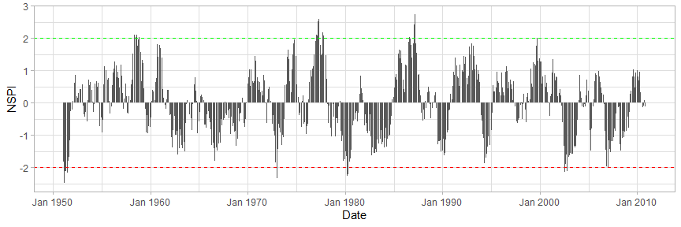

doughtr
================

## Overview

droughtr is an R for package that enables drought monitoring and drought
forecasting. It computes the Standardized Precipitation Index (SPI) and
the Non-Standardized Precipitation Index (NSPI) using General Additive
Models for Location Scale and Shape (GAMLSS). It enables the generation
of drought forecasts for univariate time series and deals with the bias
introduced to drought forecasting applications when SPI and NSPI are
calculated incorrectly during out-of-sample (OOS) validation.

## Installation

``` r
# Install the development version on Github
devtools::install_github("mammask/droughtr")
```

## Usage

``` r
# Load droughtr library
library(droughtr)

# Generate synthetic monthly rainfall data using the Gamma distribution
rain = dummyrainfall(startYear = 1950, endYear = 2010)

# Compute the non-stationary standardized precipitation index (NSPI) for scale 12 using GAMLSS
drought = computenspi(monthlyRainfall = rain, stationary = FALSE, spiScale = 12)
```

    ## GAMLSS-RS iteration 1: Global Deviance = 3477.976 
    ## GAMLSS-RS iteration 2: Global Deviance = 3477.959 
    ## GAMLSS-RS iteration 3: Global Deviance = 3477.959

``` r
# Plot NSPI
plot(drought)
```

<!-- -->

[](%22%3CREADME_files/figure-gfm/unnamed-chunk-2-1.png%3E#%3C5%3Ex%3C5%3E%22)
<!--#  -->
