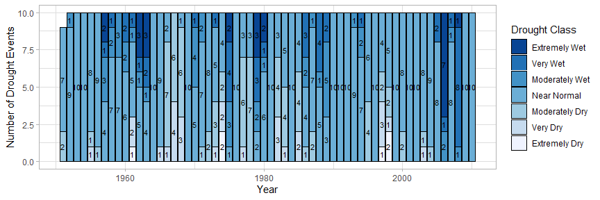

droughtR
================

[](https://zenodo.org/badge/latestdoi/398032827)


droughtR is an R for package that enables drought monitoring and drought
forecasting. It computes the Standardized Precipitation Index (SPI) and
the Non-Standardized Precipitation Index (NSPI) using General Additive
Models for Location Scale and Shape (GAMLSS). It enables the generation
of drought forecasts for univariate time series and deals with the bias
introduced to drought forecasting applications when SPI and NSPI are
calculated incorrectly during out-of-sample (OOS) validation.

## Installation

``` r
# Install the development version on Github
devtools::install_github("mammask/droughtR")
```

## Usage

### Generate SPI and NSPI

``` r
# Load droughtR library
library(droughtR)
#> Registered S3 method overwritten by 'quantmod':
#>   method            from
#>   as.zoo.data.frame zoo

# Generate synthetic monthly rainfall data using the Gamma distribution
rain = dummyrainfall(startYear = 1950, endYear = 2010)

# Compute the non-stationary standardized precipitation index (NSPI) for scale 12 using GAMLSS
drought = computenspi(x = rain, stationaryspi = FALSE, spiScale = 12, dist = 'gamma')
#> GAMLSS-RS iteration 1: Global Deviance = 3480.109 
#> GAMLSS-RS iteration 2: Global Deviance = 3480.039 
#> GAMLSS-RS iteration 3: Global Deviance = 3480.039

# Plot NSPI
plot(drought)
```


### Reduced-Bias forecasting framework

#### Data Split

Split the rainfall series into training validation and test set:

``` r
rain = oossplit(x = rain, trainratio = 0.6, validationratio = 0.2, testratio = 0.2)
print(rain)
#>          Date Rainfall Split
#>   1: Jan 1950 7.612410 Train
#>   2: Feb 1950 9.083329 Train
#>   3: Mar 1950 6.825299 Train
#>   4: Apr 1950 6.887527 Train
#>   5: May 1950 7.327183 Train
#>  ---                        
#> 606: Jul 2010 7.342196  Test
#> 607: Aug 2010 7.389638  Test
#> 608: Sep 2010 8.389338  Test
#> 609: Oct 2010 9.227088  Test
#> 610: Nov 2010 8.165557  Test
```

#### Bias measurement

When the Standardized Precipitation Index is calculated as part of a
forecasting task it can potentially introduce biases in the training
data. This is mainly because in many cases the index is computed using
the entire data, prior to model validation, and this violates some of
the fundamental principles of time series forecasting theory.

In this section, we compute the amount of bias introduced to the
training set by measuring the number of miss-classifications in the
training data. Two computational approaches are presented: 1) SPI is
computed using the training data only; we call this as “Bias Corrected”
computation and 2) SPI is computed using the entire data; we call this
as “Bias Induced” computation.

We measure bias by computing the number of miss-classifications in the
training set due to the incorrect computation of the index. We also
measure the number of records impacted and share a plot of the two
computational approaches.

``` r
# Generate synthetic monthly rainfall data using the Gamma distribution
rain = dummyrainfall(startYear = 1950, endYear = 2010)

# Compute bias
bias = measurebias(x = rain, trainratio = 0.6, validationratio = 0.2, testratio = 0.2, stationaryspi = TRUE, spiscale = 12, dist = 'normal')
#> GAMLSS-RS iteration 1: Global Deviance = 2143.999 
#> GAMLSS-RS iteration 2: Global Deviance = 2143.999 
#> GAMLSS-RS iteration 1: Global Deviance = 3602.639 
#> GAMLSS-RS iteration 2: Global Deviance = 3602.639
bias
#> $Transitions
#>     Bias Corrected Class Bias Induced Class   N
#>  1:          Near Normal        Near Normal 215
#>  2:       Moderately Wet     Moderately Wet  26
#>  3:       Moderately Wet        Near Normal   3
#>  4:             Very Wet           Very Wet   6
#>  5:          Near Normal     Moderately Dry   5
#>  6:       Moderately Dry     Moderately Dry  39
#>  7:       Moderately Dry           Very Dry   1
#>  8:          Near Normal     Moderately Wet   9
#>  9:       Moderately Dry        Near Normal   9
#> 10:             Very Dry     Moderately Dry   7
#> 11:             Very Dry           Very Dry   6
#> 12:        Extremely Dry           Very Dry   2
#> 13:        Extremely Dry      Extremely Dry   4
#> 14:        Extremely Wet      Extremely Wet  15
#> 15:             Very Wet      Extremely Wet   1
#> 16:       Moderately Wet           Very Wet   7
#> 
#> $`Impacted Records`
#> [1] "12.39% of records changed drought class"
#> 
#> $Plot
```



<!-- #### Bias Corrected auto.arima -->
<!-- In this section, we perform out-of-sample validation using a bias corrected auto.arima to forecast the Standardized Precipitation Index (SPI). An additional parameter is introduced to forecast::auto.arima and requires fitting a S-ARIMA model: -->
<!-- ```{r, eval=TRUE, fig.height=3, fig.width=5} -->
<!-- # out-of-sample validation using a bias corrected auto.arima -->
<!-- model = bcautoarima(x = rain, -->
<!--                     trainratio = 0.8, -->
<!--                     validationratio = 0.0, -->
<!--                     testratio = 0.2, -->
<!--                     stationaryspi = TRUE, -->
<!--                     spiscale = 12, -->
<!--                     seasonal = TRUE) -->
<!-- ``` -->
<!-- The model returns a set of diagnostics and analytical outcomes, including the model description, diagnostics plots and actual vs. predicted forecasts: -->
<!-- ```{r, eval=TRUE, fig.height=3, fig.width=5, echo = TRUE} -->
<!-- # Return the model description -->
<!-- model[['Diagnostics']][['Model Description']] -->
<!-- # Return R2 score in the test set -->
<!-- model[['Diagnostics']][['R2 Score Test']] -->
<!-- ``` -->
<!-- Actual vs. predicted SPI in the test set: -->
<!-- ```{r, eval=TRUE, fig.height=3, fig.width=5, echo = TRUE} -->
<!-- model[['Diagnostics']][['Actual vs Predicted Test']] -->
<!-- ``` -->
<!-- Additional models are developed and can be found here: -->
<!-- * Bias induced auto.arima -->
<!-- * Bias corrected modwt auto.arima -->
